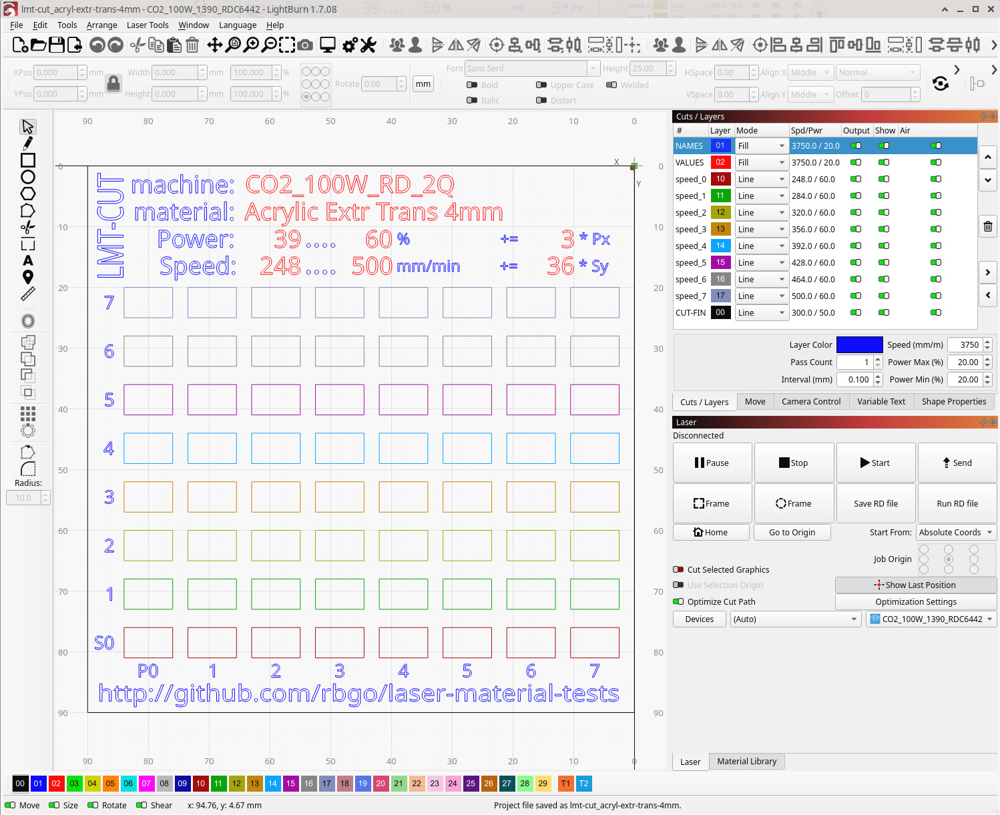

:doctype: book
:document-title: Laser Material Tests

= Laser Material Tests
:toc:

== Introduction

Laser machines each have their own settings for delivering best cutting and engraving results for a target material. +
First thing you like to know when working with a laser, is what the speed and power settings are for a particular material. +
This repository provides laser cutting and engraving tests, revealing these speed and power settings. +
These are each stored in their own directory, using a laser machine identifier as the name, so you can quickly get closest to what you may need.

.Laser material cutting test inside LightBurn

== Laser Machine Identifier

Identifying a laser can be done by machine brand and type, but many of these have same laser-tech and optical-power, leading to common speed(mm/min) and power settings (%).
To avoid flooding this repository with duplicate kind a like machines and settings, laser-tech and optical-power are most significant in the machine identifier, and will group those machines.

The laser machine identifier string has the following format: +
`${laser-tech}_${optical-power}_${file-format}_${optical-quality}` +

=== ${laser-tech}

Must be `CO2`, or `UVD` for UV diode.

=== ${laser-power}

Must be number of watts followed by char 'W'.

=== ${file-format}

Must be 'RD' for Ruida controllers, 'GC' for gcode driven lasers.

This is an important distinguisher to add to the identifier, because in LightBurn, *Power Scale* for `GC` driven machines need to be setup differently than for `RD` machines.

NOTE: The *Power Scale* setting on tab: _Shape Properties_ is used in LightBurn for the rectangle columns p0...p7 to vary the power between the given lowest to highest percentage range.

For 'RD' machines the *Power Scale* is like a 0...100% slider between *Power Min* and *Power Max* range, which are made the same for all rectangle test layers. Because there are 7 step ups between the 8 columns, that is p0 till p7, the *Power Scale* increments for each column are from 0% for p0, incremented by 100% / 7 += ~14.29% for each column. In an 'RD' file, select each column of rectangles, from p0...p7, one at a time, and watch that *Power Scale* += 14.29%. This must stay consistent and for changing the power range, change the *Power Min* and *Power Max* settings, equally the same for each rectangle test layer.

'GC' machines miss out on the Min-Power setting completely (except for that one option _image grayscale mode engraving_). The *Power Max* is simply set to 100% for all the test rectangle layers and this must stay consistent, and for changing the power range, the *Power Scale* for the columns need to be set to the literal power percentage between a given test range. +
Let that range for example be 45...80% power, that is 80 - 45 = 35 / 7 = 5 step increments on *Power Scale* for columns p0...p7; that is p0=45 and then 50 55 60 65 70 75 p7=80. +

WARNING: Coming from a 'GC' machine, I took that method to this 100W 'RD' machine primer for me. It caused to engrave with 100% power without variations among the columns. It didn't look pretty and there was obviously something to figure out.

=== ${optical-quality}

Must be 1...5 followed by 'Q'.

This is an expression made by a tester that created the directory, for giving an estimated star rating for the quality of the laser light delivery of his machine.

.Parts that influence optical quality
* The light source
* The mirrors
* The lens
* The air assist

For the first three, which are consumables... the build quality, and then the age combined with generic load/abuse and maintenance determine the laser light delivery quality at the endpoint.

A good functioning air assist, makes sure that light delivery at the end point hits target. There is a difference here between a dust eating vibration pump having low flow and no tank, and a pro level compressor of plus 4 bar with a big tank and a consistent flow that makes sure that a 0.1mm wide cutting slot is cleared from any smoke particles, so the beam can do its job all the way down at the bottom of it; the more powerful the air assist, the faster and deeper the slot is cleaned from any light obscuring smoke particles, which improves the cutting depth, hence the thickness of the material that can be cut.

This last 'Q' part of the _Laser Machine Identifier_ adds context for interpreting, the optical power given according to factory specs, followed the speed/power settings for a succesful laser material test.
If there is a '3Q' marked machine, the power is expected to be tuned down by a `5Q` owner, having a same type but brand new or revised machine.

So within an identical laser-tech, laser-power, file-format conjunction, there are 5 slots to signify optical quality, so a searcher for settings can pick one that is closest to his machine's estimated optical quality.

== Contributing

If you like to add your _Laser Machine Identifier_ to this repository, along with cutting and engraving tests, that ultimately others can contribute to for additional materials, you are welcome.
The more _Laser Machine Identifier_ directories are here, including a range of materials and their settings, the faster searchers for settings find what they need, and a zillion on man hours out there can be saved, on getting to the right settings.

=== The Tests

These test are created inside LightBurn. Its native file format is choossen as the base information storage and exchange for this repository.
For a target _Laser Machine Identifier_, its controller's native file format, it is allowed to be exported inside LightBurn and be inside that directory, provided that it is in a modifiable/reviewable intermediate file format.

WARNING: 'RD' files can be loaded and reviewed inside Ruida's native application RDWorks before putting a machine at work with it. On the other hand, 'GC' files, kind of miss that feature and are closer to a particular machine's core instructions as a non reviewable/modifiable endpoint, and are as such "dangerous" to just let it have its way with your machine as is. +
In short, 'GC' or *.gcode files are forbidden to be part of this repository.

=== Naming prefix

Within each _Laser Machine Identifier_ as a directory name, the files in it are required to have the following prefixes:

* lms: Laser Material Settings
* lmt-cut: Laser Material Test for Cutting; there is a variety of these since there is a variety of material thicknesses
* lmt-eng: Laser Material Test for Engraving: there is one of these per material as it is material thickness independent
* lmt-img: Laser Material Test for Image Engraving: there is also one of these per material but tailored to image engraving
