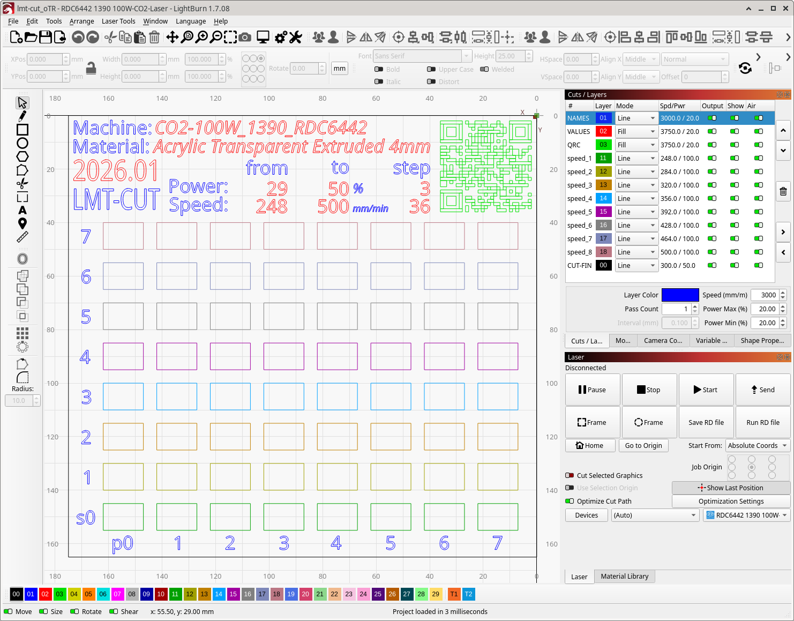

:doctype: book
:document-title: Laser Material Tests

= Laser Material Tests
:toc:

[.small]#Last update: 20251228#

== INTRODUCTION

Laser machines each have their sweet zone of delivering maximum results in cutting and engraving, having as main inputs in the process. motion speed, laser power and interaction with the material. First things you like to know when working with a laser is what the sweet spot of Power and Speed settings are for your material, so you ultimately know upfront what the result will be.

IMPORTANT: Choosing the lowest possible Power setting, the laser source will have a longer lifespan. Higher Power allows for higher Speed, but at the expense of a shortened laser source lifespan.

== The Method

Inside LightBurn software, two material tests are created: one for cutting and one for engraving.
These were made in occasion of getting the settings for a 100W CO2 Laser, having a 1300mm x 900mm work area and a Ruida RDC6442 controller.
These are free to be used as a starting point to find the settings for your laser.

After coming to the settings for your laser, by repeatedly editing and trying out, you are welcome to make a profile in this git repository for your machine, so people can faster choose a template that matches closest to their machine specs.

'''
'''
'''

.A table is easely constructed
[cols="10,90" width=50%, options="header"]
|===
| Item | Description
| A | It's the first letter of our alphabet
| B | Take a wild guess...
| C | Who say A and B, should also say this.
|===

Table after thoughts...

== Next Section to consider

==== Sub section One

Explain this

==== Sub section Two

Explain that

link:path/another/node/where/a/index.(adoc|html)/file/is/#_section_in_index[Link Title opens in new Window^] +

video::path/to/video.mp4[alternate video text]

.Literal text
----
Preformatted:
	TXT		Is shown as is
	USE		A monospace font
----

TIP: Show a tip +
or more tips +
over several +
lines

NOTE: Show a note +
or more notes +
over several +
lines

WARNING: Show a warning +
or more warnings +
over several +
lines

[CAUTION]
.This is what you should know
====
Coding using a haphazard or trial and error approach is laziness or your battery gets empty. +
Tracking all logical path ways will get to the exact formula.
====